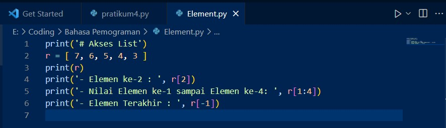
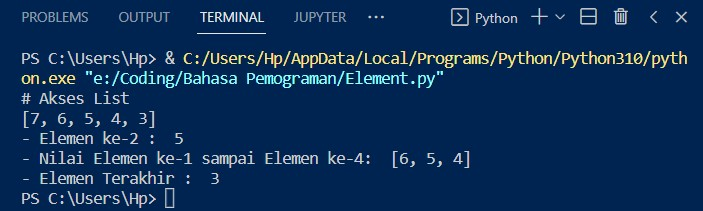
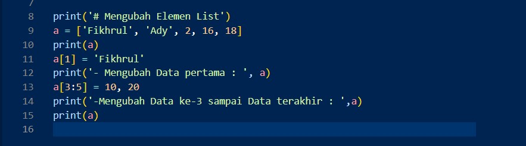
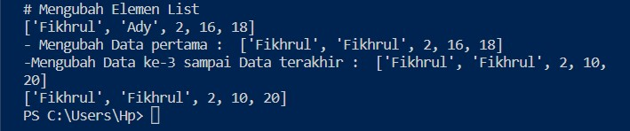
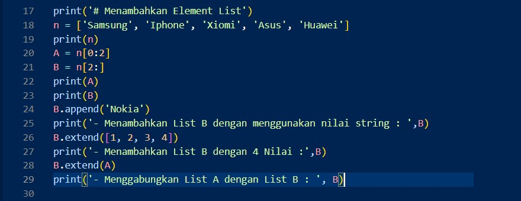
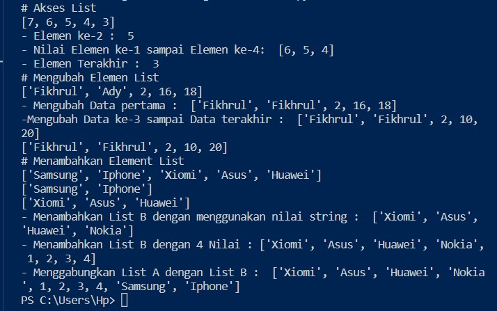
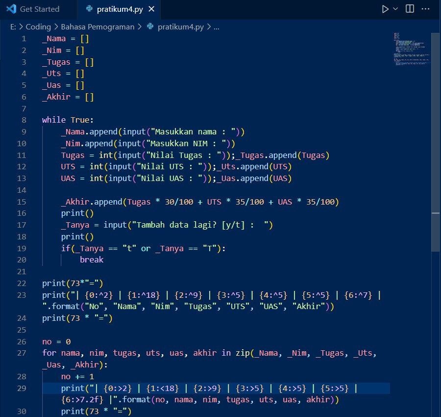
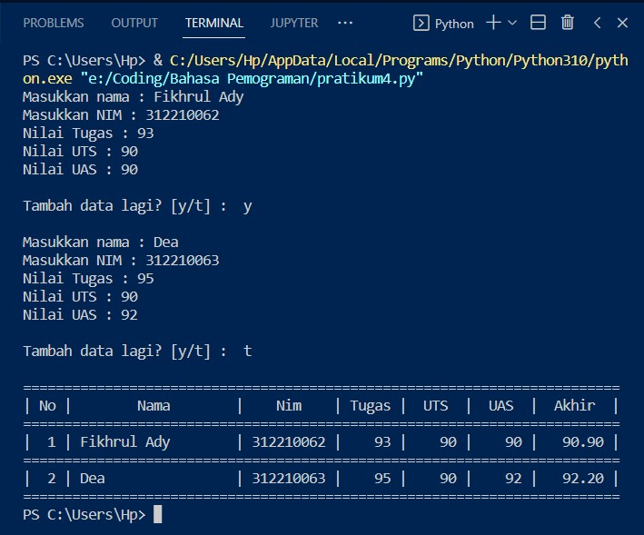
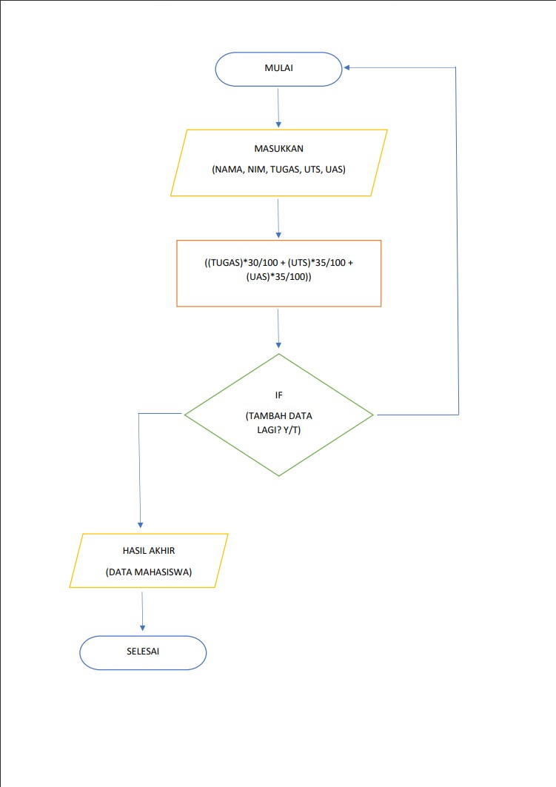

# Pratikum4

## Akses List
- Source code

- Hasil Running

## Mengubah Element List
- Source code

- Hasil Running

## Menambah Element List
- Source code

- Hasil Running

## Tugas Pratikum

- Source code

- Hasil Running

- Flowchart

### Sekian dari saya TERIMA KASIH
